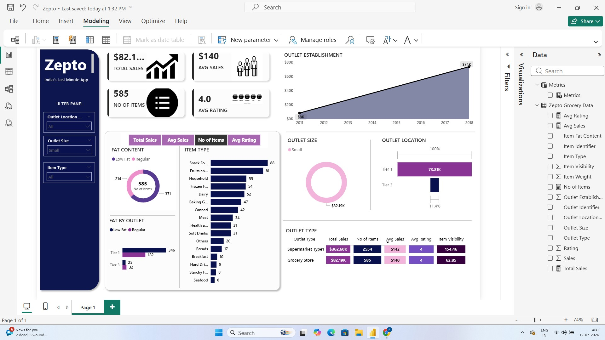

# 🛒 Zepto Sales Dashboard

An interactive **Power BI dashboard** built using the Zepto Grocery Sales dataset to analyze sales performance, outlet distribution, customer ratings, and product insights through dynamic visualizations and KPIs.

---

## 📊 Dashboard Preview



---

## 🚀 Features

- 📈 Total Sales KPI
- 💰 Average Sales Analysis
- 📦 Number of Items Sold
- ⭐ Average Customer Rating
- 🏪 Outlet Type Analysis
- 📍 Outlet Location Analysis
- 🏢 Outlet Size Analysis
- 🛍️ Item Type Analysis
- 🥛 Fat Content Analysis
- 📅 Outlet Establishment Trend
- 🎛️ Interactive Slicers for dynamic filtering

---

## 🛠️ Tech Stack

- Microsoft Power BI
- DAX
- Power Query
- Data Modeling
- Excel / CSV

---

## 📂 Project Structure

```
Zepto-PowerBI-Dashboard/
│── Zepto Dashboard.pbix
│── dashboard.png
│── dataset.csv
└── README.md
```

---

## 📈 Dashboard KPIs

| KPI | Value |
|------|-------|
| Total Sales | $82.19K |
| Average Sales | $140 |
| Number of Items | 585 |
| Average Rating | 4.0 |

---

## 📌 Key Insights

- Compared sales across different outlet locations and outlet sizes.
- Identified top-performing product categories.
- Analyzed customer ratings and product distribution.
- Built interactive filters for quick business analysis.
- Designed an executive dashboard for data-driven decision making.

---

## 👩‍💻 Author

**Ritu Mahajan**

Final-Year B.Tech Computer Engineering Student

- 💼 Aspiring Data Analyst & Power BI Developer
- 🔗 GitHub: https://github.com/mahajanritu
- 🔗 LinkedIn: https://www.linkedin.com/in/ritu-mahajan-6175a1393/

---

⭐ **If you found this project useful, please consider giving it a Star!**
